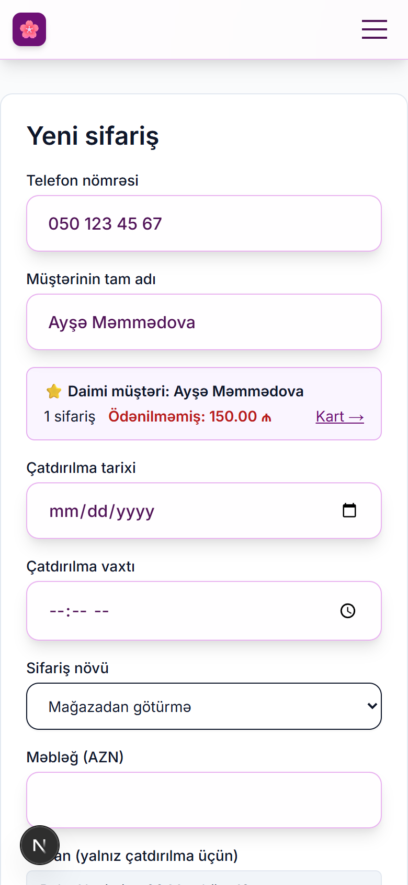
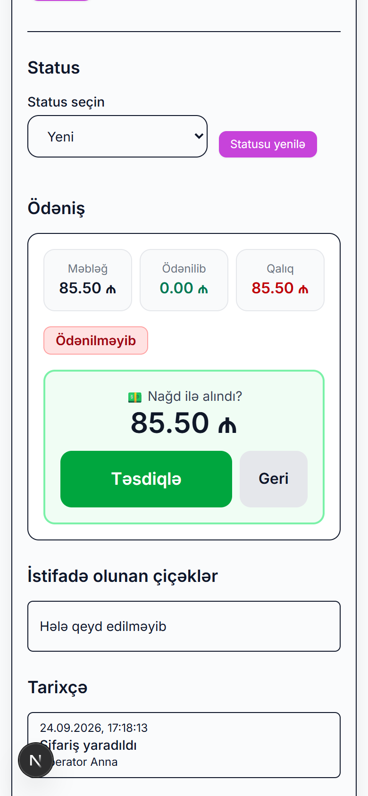
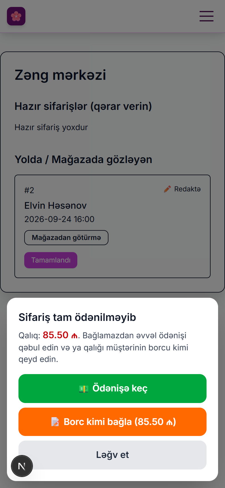
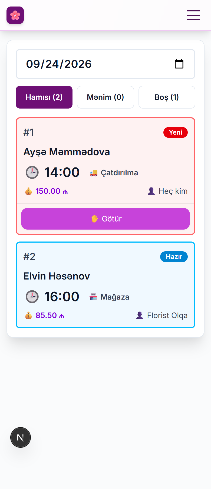

# Flower OMS — işçilər üçün təlimat

Bu təlimat mağazanın bütün işçiləri üçündür. Hər rol üçün ayrıca bölmə var. Özünüzə aid bölməni oxuyun.

- [Ümumi: sistemə giriş](#ümumi-sistemə-giriş)
- [Operator (zəng mərkəzi / satıcı)](#operator)
- [Florist](#florist)
- [Administrator](#administrator)
- [Tez-tez verilən suallar](#tez-tez-verilən-suallar)

> Şəkillər kompüter (1280 px) və telefon (390 px) ekranından götürülüb. Sistem hər ikisində işləyir.
>
> Təlimat **1-ci dalğa yeniləmələrindən sonrakı** versiyanı təsvir edir: ödənişin təsdiqi, qalıqlı sifarişin bağlanması, florist lövhəsində filtrlər və «Götür» düyməsi, telefonla müştərinin tanınması.

---

## Ümumi: sistemə giriş

1. Brauzerdə mağazanın ünvanını açın (məsələn, `https://sifaris.magaza.az`).
2. **İstifadəçi adı** və **şifrə** daxil edin. Onları sizə administrator verir.
3. **Daxil ol** düyməsini basın.

- Şifrəni bir neçə dəfə səhv yazsanız, sistem bir müddət girişi bağlayır. Bir az gözləyin.
- Şifrəni dəyişmək üçün yuxarıda adınıza basın → **Profil**.
- İşi bitirəndə **Çıxış** düyməsini basın. Bu, xüsusən ortaq kompüterdə vacibdir.

Girişdən sonra **Panel** açılır. Orada sizin rolunuza uyğun bölmələr görünür.

---

## Operator

Operator zəngi qəbul edir, sifarişi yaradır, müştərini tapır, hazır sifarişi kuryerə verir və ya mağazada təhvil verir, ödənişi qəbul edir.

### 1. Müştəri zəng edir: əvvəlcə axtarın

1. Yuxarıdakı menyudan **Sifarişlər** bölməsini açın.
2. Axtarış xanasına müştərinin adını və ya telefonunu yazın, **Axtar** düyməsini basın.
3. Müştərinin bütün məlumatlarını görmək üçün **Müştərilər** bölməsinə keçin. Orada sifariş tarixçəsi və borcu görünür.

> 💡 Telefonu istənilən formatda axtara bilərsiniz: `050 123 45 67`, `0501234567`, `+994501234567` və ya son 7 rəqəm.

### 2. Yeni sifariş yaratmaq

1. **Sifarişlər** → **➕ Yeni sifariş**.
2. Xanaları doldurun:
   - Əvvəlcə **Telefon nömrəsi**. İstənilən formatda yazın: `050 123 45 67`, `0501234567`, `+994…`. Nömrə tanışdırsa, sistem **adı və son ünvanı özü doldurur** və «⭐ Daimi müştəri: … sifariş · Ödənilməmiş …» zolağını göstərir. Doldurulmuş xanaları istəsəniz dəyişə bilərsiniz.
   - **Müştərinin tam adı**. Yeni müştəri üçün əl ilə yazın.
   - **Çatdırılma tarixi** və **vaxtı**. Mağazadan götürmədə müştərinin gələcəyi vaxtı yazın.
   - **Sifariş növü**: *Mağazadan götürmə* və ya *Çatdırılma*.
   - **Məbləğ (AZN)**. Vergül də, nöqtə də olar: `85,50` və ya `85.50`.
   - **Ünvan**. Çatdırılma üçün məcburidir.
   - **Qeyd / xüsusi istəklər**. Alıcının adı və telefonu, açıqcanın mətni, rəng istəyi və s.
   - **Şəkillər**. Müştərinin göndərdiyi nümunə şəkil (5-ə qədər). Florist bu şəkilləri görəcək.
3. **Sifarişi yarat** düyməsini basın. Yaradılmış sifarişin kartı dərhal açılır: «✅ Sifariş #N yaradıldı». Beh (avans) varsa, elə orada ödənişi qeyd edin.

> ⚠️ Məcburi xana boş qalarsa, sistem sifarişi yaratmır və xəbərdarlıq edir.

### 3. Sifariş kartı

Siyahıda sifariş nömrəsinə (`#4`) basın. Kartda bunlar var:

- sifarişi **redaktə** etmək (tarix, vaxt, məbləğ, ünvan) və **Yenilə** düyməsi;
- **Status**. Siyahıdan seçib **Statusu yenilə** basın;
- **Ödəniş**, **İstifadə olunan çiçəklər**, **Tarixçə** (kim nə vaxt nə edib), **Şəkillər**.

### 4. Ödəniş qəbul etmək

Sifariş kartında **Ödəniş** bölməsində yuxarıda **Məbləğ**, **Ödənilib** və **Qalıq** görünür.

| Düymə | Nə vaxt |
|---|---|
| 💵 **Nağd ödəniş (X ₼)** → **Təsdiqlə** | Müştəri qalığın hamısını nağd ödəyir |
| 💳 **Kart ilə ödəniş (X ₼)** → **Təsdiqlə** | Qalığın hamısı kartla (POS) |
| 🔀 **Qarışıq / qismən ödəniş** | Bir hissə nağd, bir hissə kart, və ya yalnız beh (avans) |
| 📝 **Borc** | Müştəri sonra ödəyəcək. Qeyddə nə vaxt ödəyəcəyini yazın |

> ✅ «Nağd» və «Kart» düymələri əvvəlcə məbləği göstərir: «💵 Nağd ilə alındı? 85.50 ₼». Pul yalnız **Təsdiqlə** basdıqdan sonra qeyd olunur, **Geri** heç nə yazmır. Səhv ödənişi yalnız administrator ləğv edə bilər.
>
> 

Borc sonra ödənildikdə həmin sifarişi açın və nağd və ya kart düyməsi ilə ödənişi qeyd edin.

### 5. Hazır sifarişi göndərmək və bağlamaq

1. Menyuda **Zəng mərkəzi** bölməsini açın.
2. **Hazır sifarişlər** blokunda hər sifariş üçün seçin:
   - **Mağazadan götürmə**: buket mağazada müştərini gözləyir;
   - **Çatdırılma**: buket kuryerə verildi.
3. Müştəri buketi alanda **Yolda / Mağazada gözləyən** blokunda **Tamamlandı** düyməsini basın.

> Sifarişin qalığı varsa, **Tamamlandı** basanda sistem soruşur:
> - **💵 Ödənişə keç**: sifarişin ödəniş bölməsi açılır;
> - **📝 Borc kimi bağla**: sifariş bağlanır, qalıq müştərinin borcu kimi tarixçəyə yazılır;
> - **Ləğv et**: heç nə dəyişmir.
>
> 

---

## Florist

Florist günün sifarişlərini görür, sifarişi götürür, istifadə etdiyi çiçəkləri qeyd edir, buketin şəklini çəkir və «hazırdır» qeyd edir. Telefonla işləmək çox rahatdır.

### 1. Günün sifarişləri

1. Menyuda **Florist** bölməsini açın.
2. Yuxarıda tarixi seçin. Standart olaraq bu gün seçilir.
3. Yuxarıda filtrlər var: **Hamısı**, **Mənim** (sizin götürdükləriniz), **Boş** (heç kim götürməyib). Mötərizədə sayları göstərilir.
4. Kartın rəngi və nişanı statusu göstərir:
   - 🔴 **Yeni**: hələ heç kim götürməyib;
   - 🟠 **Hazırlanır**;
   - 🔵 **Hazır**: müştərini və ya kuryeri gözləyir;
   - 🟢 **göndərilib və ya tamamlanıb**.
5. Boş sifarişi götürmək üçün kartın altında **✋ Götür** düyməsini basın. Sifariş sizin adınıza keçir, başqa florist onu dəyişə bilməz.
6. Lövhə **hər 30 saniyədən bir özü yenilənir**: operatorun yeni sifarişi səhifəni yeniləmədən görünür.

### 2. Sifarişi hazırlamaq

1. Karta basın. Sifarişin bütün məlumatları açılır: tarix, vaxt, müştəri, ünvan, qeyd, nümunə şəkillər.
2. **🛠️ Hazırlamağa başla** düyməsini basın. Sifariş sizin adınıza keçir və başqa florist onu dəyişə bilməz.
3. **🌷 İstifadə olunan çiçəklər**: axtarışda çiçəyi tapın, **+** və **−** ilə miqdarı qeyd edin.
4. **Çiçəkləri yadda saxla** düyməsini basın və ya birbaşa status düyməsinə keçin: qeyd etdiyiniz çiçəklər status dəyişəndə **avtomatik yadda saxlanılır** və anbar azalır.

> ℹ️ Anbarda kifayət qədər çiçək yoxdursa, sistem xəbərdarlıq edir və **status dəyişmir**. Bunu administratora deyin.
>
> Yadda saxlanmamış çiçəklərlə səhifədən çıxmaq istəsəniz, brauzer soruşacaq.

### 3. Buketin şəkli

1. Aşağıda **📸 Hazır buketin şəkillərini əlavə et** → **Şəkil seçin**.
2. Telefonda kamera açılır: şəkil çəkin. Bir neçə şəkil də olar (hər biri 10 MB-a qədər).
3. Şəkil **🌸 Hazır buketin şəkilləri** blokunda görünür. Səhv şəkli 🗑️ ilə silin.

### 4. Hazırdır

1. İstəsəniz, **Hazırlıq qeydi** yazın (məsələn, «qırmızı lent əlavə olundu»).
2. **✅ Buket hazırdır** düyməsini basın. Operator sifarişi dərhal «Hazır» siyahısında görür.
3. Sonra lazım olsa:
   - **🚚 Kuryerə verildi** və ya **🏪 Müştəri gözlənilir**;
   - **↩️ Yenidən hazırlanır**, əgər buketi düzəltmək lazımdırsa.

### 5. Ödəniş (mağazada müştəri gələndə)

**💳 Ödəniş idarə et** düyməsi pəncərə açır. Qaydalar operatordakı kimidir ([Ödəniş qəbul etmək](#4-ödəniş-qəbul-etmək)).

---

## Administrator

Administrator anbarı, işçiləri, hesabatları idarə edir və operator ilə floristin bütün imkanlarına sahibdir.

### 1. Anbar (çiçəklər)

1. Menyu → **Anbar**.
2. **Yeni çiçək**: ad, vahid (*Ədəd*, *Dəstə*, *Qutu*), ehtiyat, aşağı səviyyə, sonra **Əlavə et**. Vahid floristin ekranındakı ilə eynidir.
3. Mövcud çiçəyin ehtiyatını dəyişin və **Yenilə** basın. Hər dəyişiklik tarixçədə saxlanır. Telefonda hər çiçək ayrıca kartdır, ehtiyatı böyük **−** / **+** düymələri ilə dəyişmək olar.
4. **Aşağı səviyyə**: ehtiyat bu rəqəmə düşəndə çiçək sarı rənglə və «Aşağı ehtiyat» nişanı ilə göstərilir.
5. İstifadə olunmayan çiçəyi silməyin, **Aktiv** işarəsini götürün.

### 2. İşçilər

1. Menyu → **İstifadəçilər** → **➕ Yeni İstifadəçi**.
2. İstifadəçi adı, ad, rol (*Administrator*, *Operator*, *Florist*) və şifrəni (ən azı 8 simvol) daxil edin.
3. İşdən çıxan işçi üçün **Deaktiv et** düyməsini basın. O, dərhal sistemdən çıxır, amma onun sifariş tarixçəsi qalır.
4. Şifrəni unudan işçi üçün redaktə pəncərəsində yeni şifrə təyin edin.

### 3. Hesabatlar və Excel

**Satışlar** bölməsində:

1. **Başlanğıc** və **Son** tarixləri seçin, **Göstər** basın.
2. Sifariş sayı, mağazadan götürmə və çatdırılma, toplam məbləğ, nağd, kart, ödənilməmiş (borc) və günlər üzrə cədvəl görünür.
3. **⬇️ CSV (Excel)** düyməsi faylı yükləyir. Excel-də birbaşa açılır, Azərbaycan hərfləri düzgün görünür.

> ℹ️ Hesabat sifarişlərin **çatdırılma tarixinə** görə hesablanır, ödəniş tarixinə görə yox.

**Performans** bölməsi seçilmiş dövrdə hər floristin neçə buket hazırladığını və neçə çiçək işlətdiyini göstərir.

### 4. Müştərinin məlumatlarını dəyişmək

**Müştərilər** → müştərini açın → **✏️ Redaktə et**. Ad, telefon, email, **doğum tarixi**, ünvan, qeyd və «Aktiv» dəyişdirilə bilər. Bu nömrə başqa müştəridə varsa, sistem xəbərdarlıq edir. Bu imkan operatorda da var.

### 5. Səhv ödənişi ləğv etmək

Sifariş kartında **Ödəniş tarixçəsi** siyahısında səhv ödənişin yanında **Ləğv et** düyməsini basın. Ləğv tarixçədə kimin etdiyi ilə birlikdə qalır.

---

## Tez-tez verilən suallar

**Sistemə girə bilmirəm.** İstifadəçi adını və şifrəni yoxlayın. Bir neçə səhv cəhddən sonra bir az gözləyin. Hesabınız deaktiv edilibsə, administratora müraciət edin.

**Sifarişi başqa florist götürüb, mən dəyişə bilmirəm.** Bu normaldır: sifariş yalnız onu götürən floristə məxsusdur. Lazım olsa, administrator dəyişə bilər.

**Müştəri ləğv etdi, nə edim?** Hələ «Ləğv edildi» statusu yoxdur. Qeyddə «LƏĞV» yazın və administratora xəbər verin.

**Pulu səhv qeyd etdim.** Administratora deyin. O, ödənişi ləğv edəcək, sonra düzgün ödənişi yenidən qeyd edin.

**Telefonda nəsə ekrana sığmır.** Belə olmamalıdır. Səhifənin adını administratora deyin, müvəqqəti olaraq kompüterdən istifadə edin.
